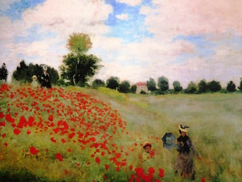

# keras-style-transfer

Neural style transfer in tensorflow

The source code of the neural style transfer can be found in 
[keras_style_transfer/library/style_transfer.py](keras_style_transfer/library/style_transfer.py)

# Usage

The demo code can be found in [keras_style_transfer/demo/style_transfer.py](keras_style_transfer/demo/style_transfer.py)
It is illustrated below, which takes in a content image and a style image to generate a new image.

```python
import scipy
import scipy.io
import scipy.misc
from matplotlib.pyplot import imshow
from keras_style_transfer.library.style_transfer import StyleTransfer


def main():
    pretrained_model_dir_path = '../training/pretrained-model'
    image_dir_path = '../training/images'
    output_dir_path = '../training/outputs'

    content_image = scipy.misc.imread(image_dir_path + "/louvre_small.jpg")
    imshow(content_image)

    style_image = scipy.misc.imread(image_dir_path + "/monet.jpg")
    imshow(style_image)

    vgg19_model_path = pretrained_model_dir_path + "/imagenet-vgg-verydeep-19.mat"
    ss = StyleTransfer(vgg19_model_path)

    generated_image = ss.fit_and_transform(content_image, style_image,
                                           output_dir_path=output_dir_path)


if __name__ == '__main__':
    main()
```

Below is the content image:


Below is the style image:



Below is the generated image from the content image and the style image


# Note
The utility class [keras_style_transfer/library/nst_utils.py](keras_style_transfer/library/nst_utils.py) 
is taken from [https://github.com/shahariarrabby/deeplearning.ai](https://github.com/shahariarrabby/deeplearning.ai)


